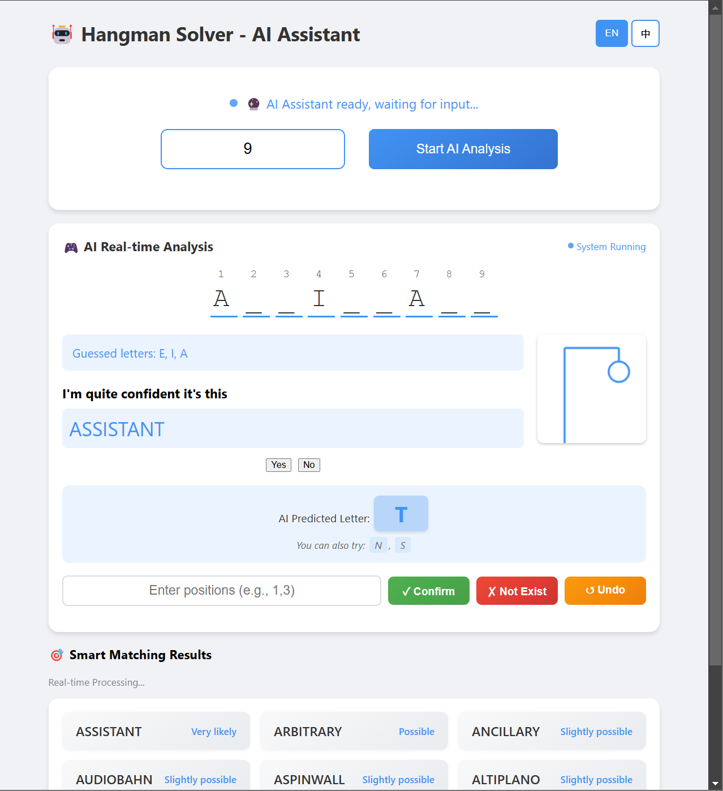
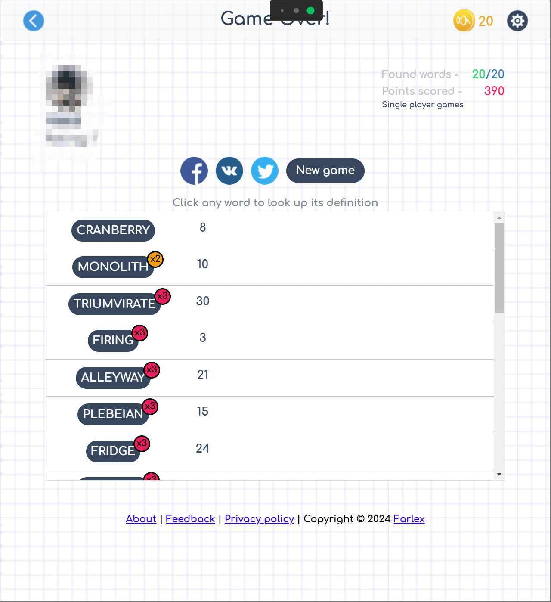
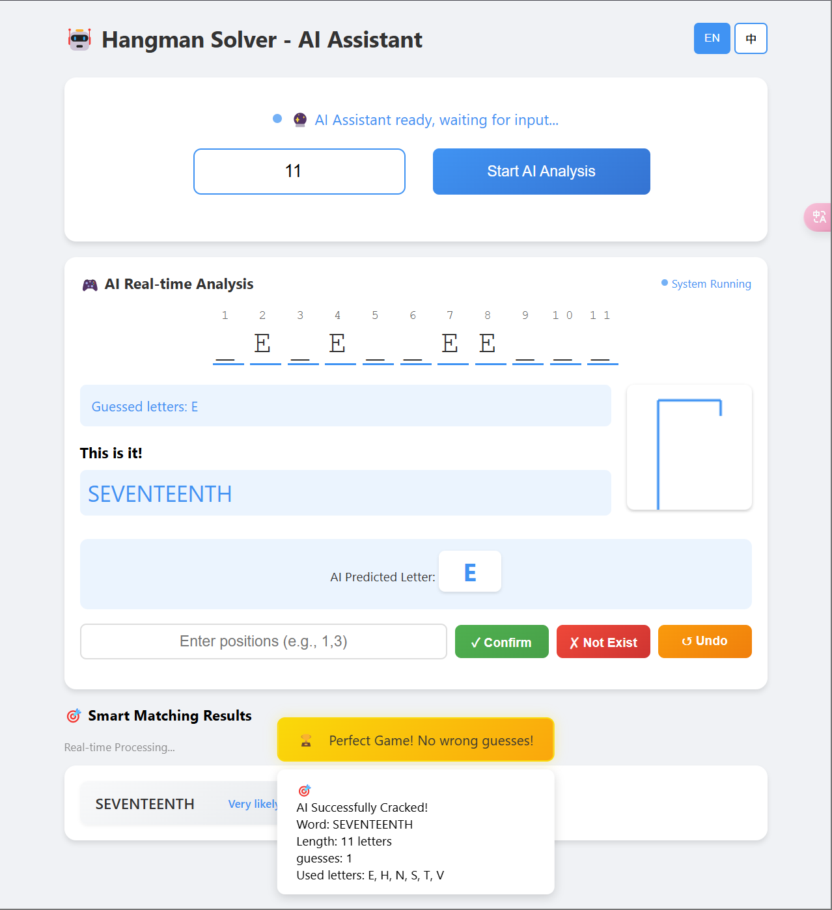
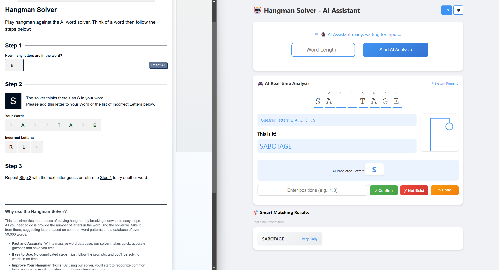

# Hangman Solver - AI Assistant

An intelligent AI assistant that helps solve Hangman puzzles using word frequency analysis and pattern matching algorithms.

*AI Assistant Interface - Real-time word analysis and suggestions*

## Performance & Key Advantages

- **Extensive Word Database**: Contains over 220,000 words, including proper nouns like names, places, and brand names that are commonly used but not found in standard dictionaries

*Perfect Score - The extensive database enables the AI to successfully solve all 20 puzzles in the game*

- **Smart Letter Suggestions**: Utilizes word frequency data to make intelligent letter predictions, significantly improving accuracy

*High Efficiency - Smart letter prediction allows solving words with minimal guesses*

- **High Performance**: Fast computation speed and efficient letter recommendation algorithm that quickly narrows down possible words

*Superior Performance - The efficient algorithm results in fewer wrong guesses compared to other word guessing websites*

## Features

- AI-powered word suggestion system
- Pattern-based word filtering
- Word frequency analysis
- Interactive web interface
- Real-time suggestions
- Learning capability from user feedback

## Project Structure

- `assistant.html` - Main interface for the AI assistant
- `assistant.js` - Core AI logic and user interactions
- `WordFrequency.csv` - Word database with frequency data
- `styles.css` - UI styling

## Setup

1. Clone the repository
2. Open `assistant.html` in a modern web browser

## How to Use

1. Input the current pattern using underscores (_) for unknown letters
2. Add any known incorrect letters
3. The AI will suggest the most probable words and next best letters to try
4. Update the pattern as you get more information
5. Repeat until the word is solved

## Technologies Used

- HTML5
- CSS3
- JavaScript
- Natural Language Processing
- Probability Analysis

## How It Works

The assistant uses a combination of:
- Word frequency analysis
- Pattern matching
- Letter frequency statistics
- Machine learning algorithms
to make intelligent guesses and help solve Hangman puzzles efficiently.

## Contributing

Contributions are welcome! Feel free to submit:
- Bug reports
- Feature suggestions
- Pull requests

## License

This project is licensed under the MIT License - see the LICENSE file for details.